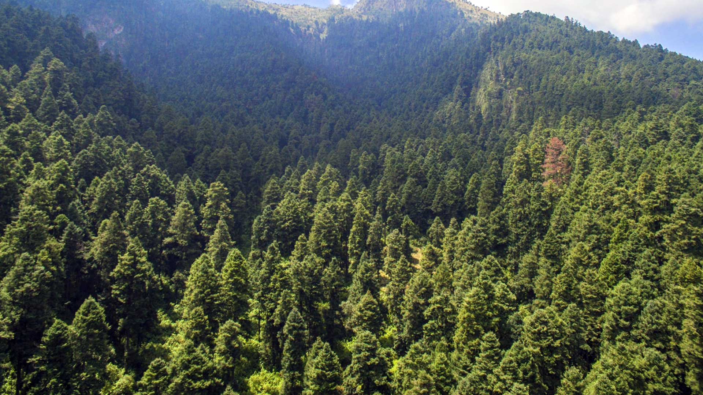
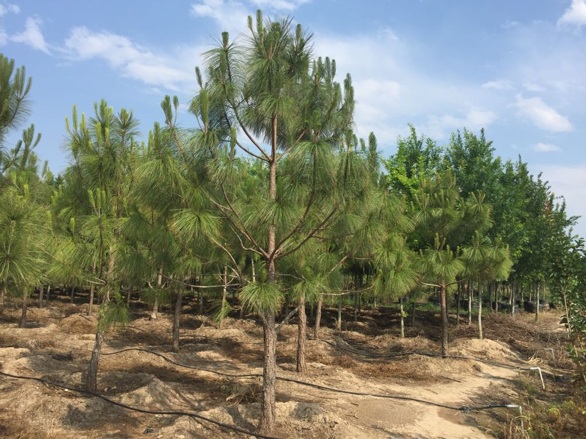
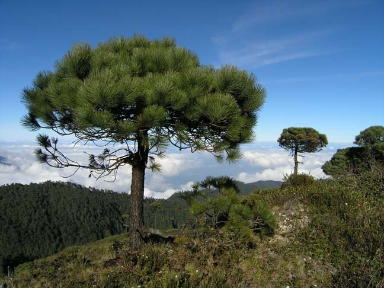
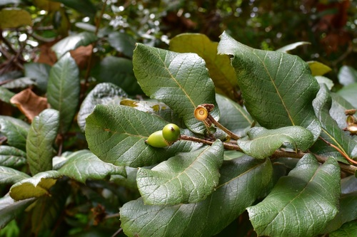
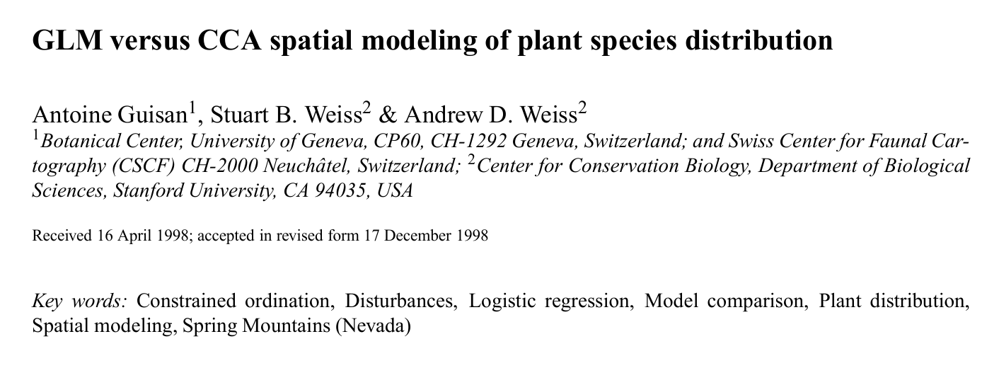

<h1>
<b>Reforestación arbórea: `¿Entender a una especie o a un ecosistema?`</b><br>
<b></b>
</h1>

<hr>

<h2>
Una comparativa entre la `regresión logística` y `CCA`
</h2>

<br>
<br>

<h3>Autores</h3>

<ul style="font-size: 1.2em;">
  <li>Rodrigo Basaldud</li>
  <li>Brenda Ramirez</li>
  <li>Seani Rodríguez</li>
</ul>

<br>

<h3>Junio 2026</h3>


{.absolute top=500 left=1000 width="800"}


# Motivación

Supongamos que la Comisión Nacional Forestal (CONAFOR) desea identificar qué especies de arboles tienen mayor probabilidad de establecerse en distintas regiones del país para apoyar diferentes programas de reforestación y restauración ecológica.

::: {.fragment}
Se cuenta con información de cientos de sitios distribuidos en bosques templados del centro de México, donde se registró:

- Altitud.
- Precipitación anual.
- Temperatura media.
- Pendiente del terreno.
- pH del suelo.
:::


---

Además, para cada sitio se registró la presencia o ausencia de especies como:

<div style="
display:grid;
grid-template-columns: 1fr 1fr;
grid-template-rows: 1fr 1fr;
gap:40px;
width:90%;
margin:auto;
margin-top:40px;
">

<div class="fragment" style="text-align:center;">

<p><b><i>Pinus montezumae</i></b></p>
</div>

<div class="fragment" style="text-align:center;">

<p><b><i>Pinus hartwegii</i></b></p>
</div>

<div class="fragment" style="text-align:center;">

<p><b><i>Quercus rugosa</i></b></p>
</div>

<div class="fragment" style="text-align:center;">

<p><b><i>Quercus laurina</i></b></p>
</div>

</div>


---

<br>
Una pregunta inmediata antes de comenzar a plantar podría ser:

<br>
<br>

::: {.fragment}
**Dadas unas condiciones ambientales específicas, ¿Qué especies pueden establecerse con mayor facilidad?**
:::

<br>
<br>

::: {.fragment}
Aparentemente podríamos identificar especies que son típicas de climas o regiones específicas, y con base en ese conocimiento comenzar con el programa de reforestación.
:::


# ¿Cuál es la dificultad de este problema?

<br>
Hay una relación de dependencia entre especies que no se debe ignorar, además en países megadiversos como México, pueden existir distintos ecosistemas en regiones "cercanas".

<br>

::: {.fragment}
Por ejemplo:

- Algunas especies tienden a compartir ambientes similares (p.ej. especies de alta montaña).

- La presencia de una especie puede influir en la presencia de otra (p.ej. especies que compiten por recursos o que tienen relaciones de facilitación).

- Estados como Oaxaca tienen una gran diversidad de ecosistemas, y analizar un ecosistema a la vez puede perder de vista el panoráma completo.
:::


---

<br>
Con lo anterior, el dilema que busca explorar esta presentación:
<br>
<br>

::: {.fragment}
>**Si el objetivo es predecir la presencia de especies arbóreas en los bosques mexicanos, ¿es preferible construir un modelo específico para cada especie o un modelo que contemple la biodiversidad de un ecosistema?**
:::

<br>


::: {.fragment}
Afortunadamente, es una discución que ya se ha hecho...
:::

---

>Esta misma cuestión fue estudiada por Guisan, Weiss y Weiss (1999), quienes compararon un GLM (regresión logística) y CCA para la predicción de distribuciones de plantas.


<br>

::: {.fragment}

<div style="
text-align:center;
margin-top:30px;
">



</div>
:::

---

<br>

Hay algunos detalles importantes:

<br>

::: {.fragment}
* ¿Por qué comparar un modelo que sí está hecho para predecir contra un modelo que está hecho para entender perfiles y estructuras? 
:::

::: {.fragment}
* Si bien, el título suguiere una competencia entre modelos, la verdadera discución es acerca cuándo conviene escoger cada enfoque, y para ilustrarlo se propone un respectivo representante.
:::

::: {.fragment}
* No tiene por qué limitarse a comparar un GLM (regresión logística) contra CCA, sin embargo la regresión logística es un modelo cómodo y el CCA nace naturalmente en el contexto de la ecología.
:::


<br>

::: {.fragment}
A continuación, introducciremos ambos enfoques y sus modelos.
:::

# Enfoque 1: Especie por especie 

<br>

Un técnico forestal podría argumentar:

<br>

::: {.fragment}
> "*Pinus hartwegii* no responde al ambiente de la misma forma que *Quercus rugosa*. Cada especie debe estudiarse individualmente."
:::

<br>

::: {.fragment}
Entonces se ajusta un modelo para cada especie:

- Un modelo para *Pinus montezumae*.
- Otro para *Pinus hartwegii*.
- Otro para *Quercus rugosa*.
- Etc.
:::

# Un modelo conocido: `Regresión Logística`

<br>

Para una especie particular, por ejemplo *Pinus hartwegii*, cada sitio puede clasificarse como:

<br>

::: {.fragment}
- Presencia ($Y=1$)
- Ausencia ($Y=0$)
:::

<br>

::: {.fragment}
La pregunta ahora es:

> ¿Cómo cambia la probabilidad de presencia de la especie cuando cambian las condiciones ambientales?
:::

<br>

---

Por ejemplo:

- ¿La probabilidad aumenta con la altitud?
- ¿Disminuye cuando la temperatura es muy alta?
- ¿Existe una combinación favorable de precipitación y pH?


<br>

::: {.fragment}
Supongamos que observamos cientos de sitios y para cada uno conocemos su altitud, temperatura, precipitación, pH, así como si la especie estuvo presente o ausente.
:::

<br>

::: {.fragment}
Este modelo busca aprender una relación entre:

$$
\text{Condiciones ambientales}
\longrightarrow
\mathbb{P}(\text{Presencia de una especie en la región})
$$
:::

---

<br>

La regresión logística modela la probabilidad de presencia de una especie mediante

$$
P(Y=1\mid x_1,\ldots,x_p)=
\frac{e^{\eta}}
{1+e^{\eta}}
$$

<br>

::: {.fragment}
donde

$$
\eta=
\beta_0+
\beta_1x_1+
\beta_2x_2+
\cdots+
\beta_px_p
$$
:::

<br>

::: {.fragment}
y las variables $x_1,\ldots,x_p$ representan las características ambientales del sitio.
:::

---

<br>

La función logística transforma cualquier combinación de variables ambientales en una probabilidad entre 0 y 1.


<br>

::: {.fragment}
Esto permite interpretar directamente el resultado del modelo:

- Valores cercanos a 0 indican baja probabilidad de presencia.
- Valores cercanos a 1 indican alta probabilidad de presencia.
- Valores intermedios reflejan incertidumbre.
:::


# Efecto de las variables ambientales

<br>

::: {.fragment}
Cada coeficiente describe cómo una variable ambiental afecta la probabilidad de presencia de la especie.
:::

<br>

::: {.fragment}
Por ejemplo:

- $\beta_{\text{altitud}}>0$ podría indicar preferencia por zonas altas.
- $\beta_{\text{temperatura}}<0$ podría indicar preferencia por ambientes fríos.
- $\beta_{\text{precipitación}}>0$ podría indicar afinidad por sitios húmedos.
:::

--- 


Entonces si $\beta_{altitud} > 0$, un sitio con gran altitud podría recibir una probabilidad alta para la presencia de *Pinus hartwegii*.


```{r logit}
#| echo: false
#| warning: false
#| message: false

library(ggplot2)

x <- seq(-3, 3, length.out = 200)
p <- 1/(1 + exp(-x))

ggplot(data.frame(x, p), aes(x, p)) +
  geom_line(linewidth = 1.5) +
  labs(
    x = "Altitud",
    y = "Probabilidad de presencia") +
  theme_minimal(base_size = 14) 
```


# Evaluación predictiva

<br>

::: {.fragment}
Una ventaja importante de este enfoque es que como la variable respuesta es binaria ($Y \in \{0,1\}$), entonces
las probabilidades estimadas pueden transformarse en predicciones de presencia o ausencia mediante un umbral.
:::

<br>

::: {.fragment}
Esto permite utilizar métricas de desempeño predictivo como:

- Accuracy.
- Sensibilidad.
- Especificidad.
- Curvas ROC.
- AUC.
:::


# Enfoque 2: Ecosistema como un todo

<br>
Un ecólogo podría responder:
<br>

::: {.fragment}
> "Los bosques mexicanos son ecosistemas complejos. Las especies no aparecen de manera aislada, sino que coexisten y hay una relación de entre ellas."
:::
<br>

::: {.fragment}
Desde esta perspectiva, se busca un modelo que logre capturar las relaciones entre las especies y su respuesta conjunta al ambiente.
:::

::: {.fragment}
Esto permite modelar:

- Varios ecosistemas de una misma región.
- Encontrar gradientes ambientales en común para distintas especies.

:::


# `Análisis de correspondencias ... ¿canónicas?` 

<br>
Antes de dar la definición del modelo, las preguntas que lo motivan son:


::: {.fragment}
- ¿Cómo resumir la información ambiental de cientos de sitios?
:::

::: {.fragment}
- ¿Cómo resumir patrones de coexistencia entre especies?
:::

::: {.fragment}
- ¿Cómo relacionar ambas cosas simultáneamente?
:::

<br>
<br>

::: {.fragment}
Respondamos cada una.
:::

# Variables ambientales

Si tenemos disponible variables ambientales de diversos sitios.

| Sitio | Temp. | Precip. | Humedad | Altitud |
|--------|--------|--------|--------|--------|
| 1 | 22 | 800 | 35 | 1200 |
| 2 | 18 | 1200 | 60 | 1800 |
| 3 | 15 | 1500 | 80 | 2400 |


::: {.fragment}
- Generalmente las variables suelen estar correlacionadas (a mayor precipitación, también hay mayor humedad).
:::

::: {.fragment}
- Se trabaja con un conjunto de datos de dimensiones altas (muchas variables ambientales).
:::


# Análisis de Componentes Principales (PCA)

<br>
<br>

Supongamos que tenemos registros de la temperatura, humedad y precipitación para diversos sitios. Al visualizar los datos no hay una estructura clara de la variabilidad.


---

Los datos originales:

```{R}
#| echo: false
#| warning: false
#| message: false
#| out-width: 100%
#| fig-width: 12
#| fig-height: 8

library(plotly)
library(dplyr)

set.seed(123)

n <- 200

# Dos gradientes ambientales subyacentes
g1 <- rnorm(n)
g2 <- rnorm(n)

altitud <- rnorm(n, 2000, 300)
temperatura <- 30 - altitud/150 + rnorm(n, 0, 1)
precipitacion <- altitud/2 + rnorm(n, 0, 100)

datos <- data.frame(
  altitud,
  temperatura,
  precipitacion
)

# PCA
pca <- prcomp(datos, scale. = TRUE)

scores <- as.data.frame(pca$x)

var_exp <- 100 * summary(pca)$importance[2,]


# Datos originales
fig1 <- plot_ly(
  data = datos,
  x = ~altitud,
  y = ~temperatura,
  z = ~precipitacion,
  type = "scatter3d",
  mode = "markers"
) |>
  layout(
    title = "Variables ambientales originales"
  )

fig1
```


---

Con la información que tengo, ¿Puedo construir nuevas variables que expliquen una mayor proporción de la varianza?

```{R}
#| echo: false
#| warning: false
#| message: false
#| out-width: 100%
#| fig-width: 12
#| fig-height: 8

fig2 <- plot_ly(
  data = scores,
  x = ~PC1,
  y = ~PC2,
  type = "scatter",
  mode = "markers"
) |>
  layout(
    title = list(
      text = "Visualización con PCA",
      font = list(size = 28)
    ),
    xaxis = list(
      title = list(
        text = "Componente 1",
        font = list(size = 24)
      ),
      tickfont = list(size = 18)
    ),
    yaxis = list(
      title = list(
        text = "Componente 2",
        font = list(size = 24)
      )
    )
  )

fig2
```


---

El PCA construye nuevas variables a partir de combinaciones lineales de las variables disponibles, que expliquen la mayor proporción de varianza de los datos.

$$
Z_j = a_{j1}X_1+a_{j2}X_2+\cdots+a_{jp}X_p
$$

La estimación de los coeficientes (pesos) se realiza mediante un problema de maximización iterativo:


Sea
$$
\mathbf{a}_i=
\begin{pmatrix}
a_{i1}\\
\vdots\\
a_{ip}
\end{pmatrix}
$$

---

Y definamos el i-ésimo componente principal como

$$
z_i=\mathbf{a}_i^{\top}\mathbf{x}.
$$

Se busca encontrar $\mathbf{a}_i$ tal que maximice la varianza de $z_i$ ,

$$
V(z_i)
=
V(\mathbf{a}_i^{\top}\mathbf{x})
=
\mathbf{a}_i^{\top}\Sigma \mathbf{a}_i,
$$


Sujeto a las restricciones

$$
\mathbf{a}_i^{\top}\mathbf{a}_i = 1,
$$

$$
\operatorname{Cov}(z_j,z_i)
=
\operatorname{Cov}(\mathbf{a}_j^{\top}\mathbf{x},
\mathbf{a}_i^{\top}\mathbf{x})
=
\mathbf{a}_j^{\top}\Sigma \mathbf{a}_i
=
0,
\qquad j=1,\ldots,i-1.
$$

---

<br>

Es decir, los componentes principales tienen correlación cero y son combinaciones lineales que reflejan la
máxima variabilidad posible una vez considerando las componentes principales que le preceden.

<br>
<br>

::: {.fragment}
Pero... El PCA está diseñado para variables continuas.
:::


::: {.fragment}
¿Qué ocurre cuando nuestros datos son abundancias (frecuencias) de especies?
:::


# Matriz de especies

<br>

Supongamos que ahora tenemos información acerca de la abundancia de especies en distintos sitios y nos interesan los perfiles de cada especie.

<br>
<br>

| Sitio | Pino | Encino | Oyamel | Cedro |
|--------|--------|--------|--------|--------|
| 1 | 5 | 1 | 0 | 0 |
| 2 | 3 | 2 | 0 | 1 |
| 3 | 0 | 1 | 8 | 0 |

# Análisis de Correspondencias (CA)

<br>
<br>

El CA busca representar simultáneamente sitios y especies en un espacio de baja dimensión preservando las distancias Ji-cuadrado. Similar al PCA, construye ejes nuevos que expliquen mayor proporción de la inercia (varianza).

<br>
<br>

::: {.fragment}
>Sitios cercanos poseen composiciones similares.
:::

::: {.fragment}
>Especies cercanas tienden a aparecer juntas.
:::


---

Sea $Y$ la  matriz de abundancias de $n$ sitios y $p$ especies.

<br>

::: {.fragment}
Se trabaja con la matriz de frecuencias relativas

$$
P=\frac{Y}{N},
$$

donde $N$ es el total de observaciones.
:::


# Formulación matemática

<br>

Sean

$$
r=P\mathbf{1},
\qquad
c=P^\top\mathbf{1},
$$

las masas de filas y columnas.

La matriz de desviaciones respecto a la independencia es

$$
P-rc^\top.
$$

Estandarizando por las masas obtenemos

$$
Z=
D_r^{-1/2}
(P-rc^\top)
D_c^{-1/2}.
$$


---

<br>
<br>


Los ejes principales se obtienen mediante la descomposición en valores singulares

<br>

$$
Z=U\Sigma V^\top.
$$

<br>

Los valores singulares determinan la inercia explicada por cada dimensión.


---


Los puntajes principales de los sitios son

$$
F=D_r^{-1/2}U\Sigma.
$$

Los puntajes principales de las especies son

$$
G=D_c^{-1/2}V\Sigma.
$$

::: {.fragment}
La inercia total está dada por

$$
I=
\sum_k \lambda_k,
$$

donde

$$
\lambda_k=\sigma_k^2.
$$

:::

# Ejemplo

- Los sitios cercanos tienen composiciones de especies similares.
- Las especies cercanas presentan patrones de ocurrencia semejantes.
- Cada eje representa una fuente importante de variación en la composición biológica.

```{R}
#| echo: false
#| warning: false
#| message: false
#| out-width: 100%
#| fig-width: 12
#| fig-height: 8

library(vegan)
data("dune")

ca_fit <- cca(dune)

plot(
  ca_fit,
  scaling = 2
)
```


---

Pero aún falta algo, el CA describe solo patrones de especies.

<br>
<br>

::: {.fragment}
No explica por qué aparecen esos patrones.
:::

<br>

::: {.fragment}
Necesitamos incorporar información ambiental.
:::

---

## Análisis de Correspondencias Canónicas (CCA)


<br>

El CCA busca gradientes ambientales que expliquen las diferencias en la composición de especies entre sitios.

<br>

::: {.fragment}

A diferencia del CA clásico, los ejes están restringidos a ser combinaciones lineales de variables ambientales.

$$
u = Xa
$$

:::


::: {.fragment}
Es decir, el CCA combina:

- Variables ambientales explicativas.
- Los patrones de especies obtenidos por CA.
:::


# Relación entre los métodos

<br>

`PCA`:

$$
\text{Ambiente}
\rightarrow
\text{Gradientes ambientales}
$$

`CA`:

$$
\text{Especies}
\rightarrow
\text{Patrones de composición}
$$

`CCA`:

$$
\text{Ambiente y Especies}
\rightarrow
\text{Patrones de especies explicados por ambiente}
$$


# Formulación 

Supongamos:

- $Y$: matriz de abundancias de especies.
- $X$: matriz de variables ambientales.

A partir de la matriz de frecuencias relativas,

$$
P=\frac{Y}{N},
$$

se construye una medida de variación basada en la distancia Ji-cuadrado.

El CCA busca vectores $a$ que maximicen

$$
\frac{
a^\top
X^\top D_r
Z D_c^{-1} Z^\top
D_r X
a
}{
a^\top X^\top D_r X a
}.
$$

---

<br>
<br>

Lo anterior conduce al problema de valores propios generalizados:

<br> 

$$
X^\top D_r
Z D_c^{-1}
Z^\top D_r X a
=
\lambda
X^\top D_r X a.
$$


::: {.fragment}

Los valores propios $\lambda_j$ representan la cantidad de inercia explicada por cada eje canónico. Similar a la varianza explicada por cada componente en el PCA.

:::


---

Los puntajes de los sitios se obtienen como

$$
u_k=Xa_k.
$$

y los puntajes de especies mediante promedios ponderados:

$$
v_k=
\frac{1}{\sqrt{\lambda_k}}
D_c^{-1}
Z^\top
D_r
u_k.
$$

::: {.fragment}

La inercia total se divide en

$$
I_{\text{total}}
=
I_{\text{restringida}}
+
I_{\text{residual}}.
$$

:::

::: {.fragment}

- **Inercia restringida:** Explicada por las variables ambientales.
- **Inercia residual:** No explicada.

:::


# Interpretación

El CCA es un Análisis de Correspondencias restringido, donde la ordenación de especies y sitios está determinada por variables ambientales observadas.

<br>
<br>

Los autovalores miden la cantidad de variación en la composición de especies explicada por dichos gradientes ambientales, mientras que los puntajes de sitios y especies permiten construir el biplot canónico.


---

Los ejes canónicos representan gradientes ambientales asociados a cambios en la composición de especies. Por ejemplo, el primer eje puede ser asociado al gradiente:


$$
\text{Climas desérticos}
.............
\text{Climas tropicales}
$$

<br>

Y el segundo puede ser asociado a:

<br>

$$
\text{Regiones costeras}
.............
\text{Regiones de montaña}
$$


<br>

Entonces

>Las especies se ubican según su asociación con cada gradiente.


# Ejemplo

Luego de realizar mediciones en 10 sitios sobre la abundancia de 4 especies además de incluir las variables ambientales: Temperatura, humedad, pH, altitud, precipitación.

```{R CCA} 
#| echo: false
#| warning: false
#| message: false

library(vegan)

especies <- data.frame(
  Sp1 = c(12,10,11,9,8,4,3,2,1,0),
  Sp2 = c(8,7,9,8,7,5,4,3,2,1),
  Sp3 = c(0,1,1,2,3,6,8,10,11,12),
  Sp4 = c(1,2,1,2,3,5,6,8,9,10)
)

rownames(especies) <- paste0("Sitio_", 1:10)


ambiente <- data.frame(
  Temperatura = c(15,16,17,18,19,20,21,22,23,24),
  Humedad     = c(90,88,85,82,80,75,70,68,65,60),
  pH          = c(5.5,5.7,5.8,6.0,6.2,6.5,6.7,6.8,7.0,7.2),
  Altitud     = c(2200,2100,2050,1950,1900,1800,1700,1650,1600,1500),
  Precipitacion   = c(95,90,88,85,80,75,70,65,60,55)
)

rownames(ambiente) <- rownames(especies)

modelo_cca <- cca(
  especies ~ Temperatura + Humedad + pH + Altitud + Precipitacion,
  data = ambiente
)

# Biplot

plot(
  modelo_cca,
  scaling = 2,
  main = "CCA: Especies y variables ambientales"
)
``` 


## Resumiendo los métodos

<br>
<br>

| Método | Datos | Objetivo |
|----------|----------|----------|
| PCA | Variables ambientales | Encontrar gradientes ambientales |
| CA | Matriz de especies | Encontrar patrones de composición |
| CCA | Especies + ambiente | Explicar la composición mediante gradientes ambientales |


# Comparación de enfoques
<br>

| Método                  | Ventajas                                                                        | Desventajas                                                       |
| ----------------------- | ------------------------------------------------------------------------------- | ----------------------------------------------------------------- |
| `Regresión logística` | Fácil interpretación de los efectos de cada variable, estimación de probabilidades. | Analiza una especie a la vez y no describe la comunidad completa. |
| `CCA`                 | Analiza comunidades completas y relaciona especies con cambios ambientales.  | Interpretación más compleja y no estima probabilidades.       |


# Ejemplo práctico: `Dune`

<br>
Usaremos el dataset `Dune` y `Dune.env` de la paquetería `vegan`, que contiene datos de abundancia de especies en 20 sitios, junto con variables ambientales como altitud, humedad y pH del suelo.

::: {.columns}

::: {.column width="70%"}

::: {.fragment}

```{R}
#| echo: true
#| code-line-numbers: "|2"

library(vegan)
data("dune.env")
head(dune.env,3)
```

:::

<br>

::: {.fragment}

```{R}
#| echo: true
#| code-line-numbers: "|2"

library(vegan)
data("dune")
head(dune[,1:5],3)
```

:::


:::
::: {.column width="30%"}
:::
:::


{.absolute top=500 left=1500 width="300"}


# Prueba codigo animado {auto-animate="true"}

-  De la paquqteria `vegan` 
-  Ejemplo con el dataset `Dune` que contiene datos de abundancia de especies en 20 sitios.

``` r

library(vegan)
data("dune.env")
head(dune.env)

```


# Prueba codigo animado 2 {auto-animate="true"}

-  De la paquqteria `vegan` 
-  Ejemplo con el dataset `Dune` que contiene datos de abundancia de especies en 20 sitios.

``` r

library(vegan)
data("dune.env")
head(dune.env)

plot(dune.env$A1, dune.env$Moisture, xlab = "Altitud", ylab = "Humedad", main = "Relación entre Altitud y Humedad")

```

# Prueba codigo con salida


```{R}

library(vegan)
data("dune.env")
head(dune.env)

plot(dune.env$A1, dune.env$Moisture, xlab = "Altitud", ylab = "Humedad", main = "Relación entre Altitud y Humedad")

```


